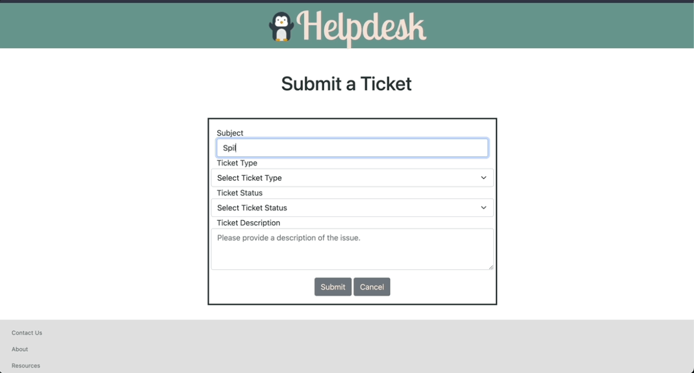

# Help Desk App

A simple app for users to create tickets and view/add updates/status changes for related issues. 

## Tech Stack

- Django
- Boostrap
- SQLite

## Features

- Login and Registration with Bcrypt
- Create, update, view, and delete tickets
- Add comment to ticket
- User can view tickets and comments created on profile page

## App Demo

